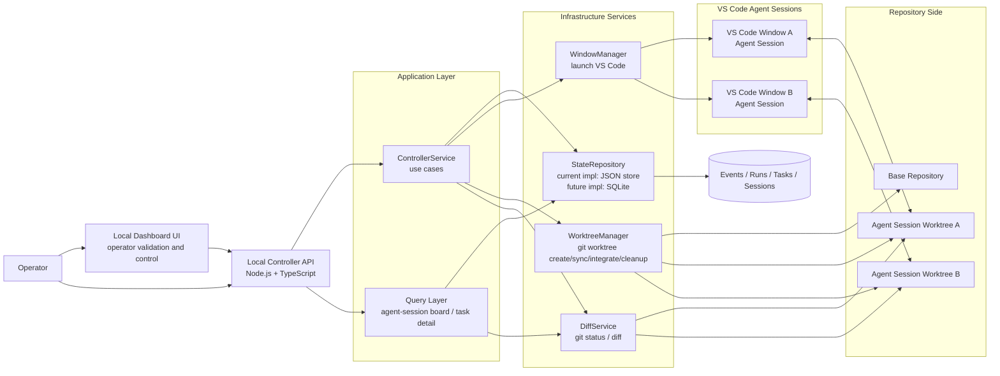

# Architecture

This document is the living architecture reference for open-agent-center.

It should be updated whenever the controller responsibilities, agent-session model, storage model, or integration boundaries change.

## Target System Diagram

## Architecture Intent

open-agent-center is a local-first control plane for managing multiple VS Code Copilot agent sessions on one machine.

The controller is the system of record for:

- projects
- agent sessions
- tasks
- runs
- artifacts
- events

Compatibility note: the current implementation still uses `worker` in internal types and `/api/workers` routes. In practice, a `worker` currently means a VS Code-backed agent session.

Each agent session is modeled as one VS Code window plus one isolated git worktree.

## Current Boundaries

### Controller

The controller exposes local HTTP APIs for orchestration and read models.

Current implementation centers on:

- project registration
- agent-session creation and worktree provisioning
- task creation
- task assignment
- agent-session launch
- agent-session diff inspection
- task detail inspection
- review queue actions and real integration outcomes
- agent-session heartbeat updates and derived offline detection
- agent-session branch sync inspection and execution
- worker cleanup and project archive lifecycle

### Application Layer

The application layer coordinates use cases and enforces state transitions.

Current core entry point:

- `src/application/controllerService.ts`

### Infrastructure Services

Current services:

- `StateRepository`: storage abstraction boundary used by the application layer
- `StateStore`: current JSON-backed implementation of the repository contract
- `WindowManager`: launches VS Code windows
- `WorktreeManager`: provisions git worktrees
- `DiffService`: reads git status and diff summaries from worker worktrees

Current storage direction:

- the controller now treats persistence as a repository boundary instead of coupling orchestration directly to one concrete store
- the current implementation is still JSON-backed
- the next persistence slice is expected to add a SQLite-backed repository implementation behind the same contract

Current sync behavior:

- worker sync fetches the target branch from origin and merges it into the worker branch
- default sync target resolves from `origin/HEAD` when not provided explicitly
- sync is blocked when the worker worktree has local uncommitted changes
- merge conflicts are returned as structured sync results instead of being hidden
- review integration uses the same git boundary and now records integrated, blocked, and conflicted outcomes in task events and artifacts

### Query Layer

The query layer shapes data for future dashboard views.

Current query modules:

- `src/queries/workerQueries.ts`
- `src/queries/taskQueries.ts`

Current worker board behavior:

- `GET /api/workers` enriches persisted worker state with live diff counts from each worktree
- the worker board also surfaces the latest branch sync result from the event log
- worker status is derived as `offline` when heartbeat age exceeds the configured timeout
- diff inspection failures do not fail the whole board; affected workers simply omit live diff metrics
- the dashboard now exposes project registration, task creation, session provisioning, assignment, heartbeat, sync, cleanup, archive, and review actions directly from the browser
- the dashboard also surfaces runtime kind for agent sessions while keeping `/api/workers` compatibility in the backend

## Current vs Planned

Implemented now:

- local controller API
- same-origin dashboard UI
- worktree provisioning
- worker launch
- worker diff endpoint
- task detail endpoint
- worker branch sync endpoint
- review queue and integration flow
- worker cleanup and project archive lifecycle
- runtimeKind support for agent-session compatibility
- application-layer orchestration entry point
- storage abstraction boundary via `StateRepository`

Planned next:

- SQLite-backed repository implementation
- runtime adapters that turn `runtimeKind` into behavior rather than metadata only

## Maintenance Rule

When changing the system, update this file if any of the following change:

- a new major service is introduced
- data ownership moves between modules
- a new external integration boundary is added
- the worker lifecycle or repository isolation model changes
- storage moves from JSON to SQLite or another backing store