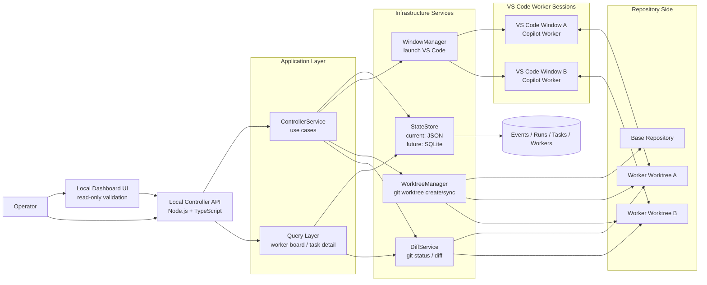

# Architecture

This document is the living architecture reference for open-agent-center.

It should be updated whenever the controller responsibilities, worker model, storage model, or integration boundaries change.

## Target System Diagram

## Architecture Intent

open-agent-center is a local-first control plane for managing multiple VS Code Copilot worker windows on one machine.

The controller is the system of record for:

- projects
- workers
- tasks
- runs
- artifacts
- events

Each worker is modeled as one VS Code window plus one isolated git worktree.

## Current Boundaries

### Controller

The controller exposes local HTTP APIs for orchestration and read models.

Current implementation centers on:

- project registration
- worker creation
- task creation
- task assignment
- worker launch
- worker diff inspection
- task detail inspection
- worker heartbeat updates and derived offline detection
- worker branch sync inspection and execution

### Application Layer

The application layer coordinates use cases and enforces state transitions.

Current core entry point:

- `src/application/controllerService.ts`

### Infrastructure Services

Current services:

- `StateStore`: local persistence, currently JSON-backed
- `WindowManager`: launches VS Code windows
- `WorktreeManager`: provisions git worktrees
- `DiffService`: reads git status and diff summaries from worker worktrees

Current sync behavior:

- worker sync fetches the target branch from origin and merges it into the worker branch
- default sync target resolves from `origin/HEAD` when not provided explicitly
- sync is blocked when the worker worktree has local uncommitted changes
- merge conflicts are returned as structured sync results instead of being hidden

### Query Layer

The query layer shapes data for future dashboard views.

Current query modules:

- `src/queries/workerQueries.ts`
- `src/queries/taskQueries.ts`

Current worker board behavior:

- `GET /api/workers` enriches persisted worker state with live diff counts from each worktree
- the worker board also surfaces the latest branch sync result from the event log
- worker status is derived as `offline` when heartbeat age exceeds the configured timeout
- diff inspection failures do not fail the whole board; affected workers simply omit live diff metrics

## Current vs Planned

Implemented now:

- local controller API
- same-origin dashboard UI
- worktree provisioning
- worker launch
- worker diff endpoint
- task detail endpoint
- worker branch sync endpoint
- application-layer orchestration entry point

Planned next:

- review queue
- SQLite migration for persistence

## Maintenance Rule

When changing the system, update this file if any of the following change:

- a new major service is introduced
- data ownership moves between modules
- a new external integration boundary is added
- the worker lifecycle or repository isolation model changes
- storage moves from JSON to SQLite or another backing store