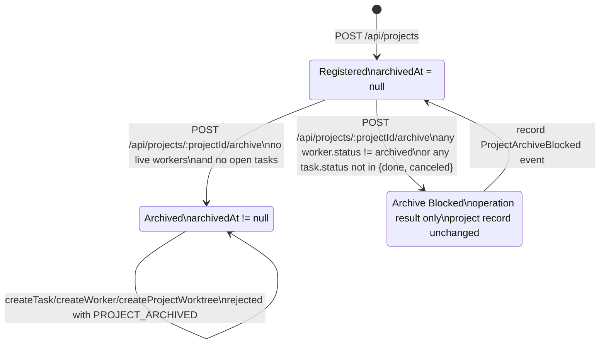
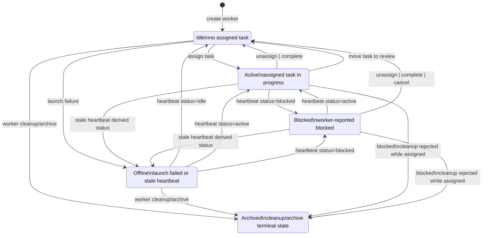
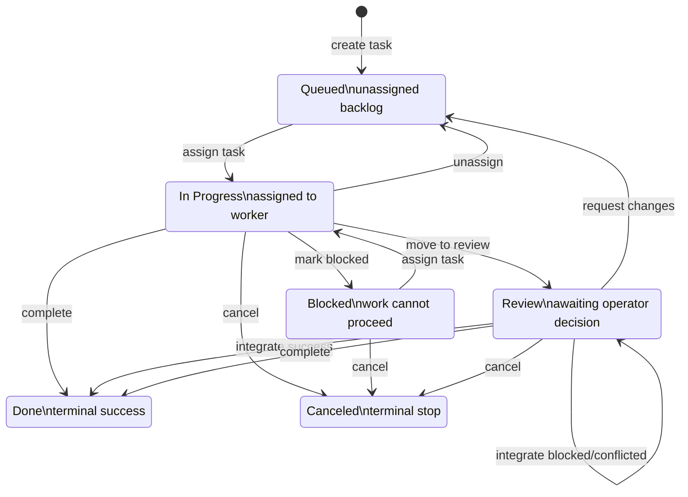

# open-agent-center

open-agent-center is a local-first control plane for orchestrating multiple VS Code Copilot agent sessions on one Windows machine.

The current implementation focuses on the first practical slice of the system:

- register a project
- provision isolated git worktrees for agent sessions
- create isolated agent sessions bound to worktree paths and branches
- create parallel development tasks
- assign tasks to agent sessions
- launch VS Code windows for agent sessions
- persist local controller state for later dashboard and review work

## Why This Exists

Running several Copilot-driven development threads in parallel quickly breaks down without isolation and visibility. The first version of open-agent-center treats each VS Code window as a local agent session and gives it:

- a unique session identity
- a dedicated worktree path
- a dedicated branch
- a tracked task assignment
- a persistent event trail

This keeps the problem grounded in supported automation boundaries. The controller manages windows, state, and review flow; Copilot interaction stays inside VS Code.

Compatibility note: the current implementation still uses `worker` in the internal domain model and `/api/workers` routes. In this repository, `worker` currently means a VS Code-backed agent session rather than the higher-level agent identity.

## Current Implementation

The repository now contains a minimal TypeScript controller service with:

- local HTTP API
- repository-backed state persistence
- default JSON-backed state persistence in `.data/state.json`
- optional SQLite-backed state persistence in `.data/state.sqlite`
- in-memory domain model for projects, agent sessions, tasks, runs, artifacts, and events
- same-origin validation dashboard served by the controller
- dashboard operator controls for task creation, assignment, agent-session provisioning, launch, heartbeat, and branch sync
- a runtime adapter boundary keyed by `runtimeKind`
- project-aware task and agent-session binding so assignments stay inside a single repository context
- a VS Code window launcher using the `code` CLI
- an application layer for orchestration use cases
- a git worktree provisioning service for new agent sessions
- a git diff inspection service for agent-session worktrees

Current source layout:

- `src/index.ts`: server bootstrap
- `src/application/controllerService.ts`: orchestration use cases
- `src/routes/api.ts`: HTTP routing
- `src/services/stateRepository.ts`: storage abstraction used by the application layer
- `src/services/stateRepositoryFactory.ts`: startup selection for JSON vs SQLite repositories
- `src/services/stateStore.ts`: JSON-backed repository implementation
- `src/services/sqliteStateRepository.ts`: SQLite-backed repository implementation using `sql.js`
- `src/services/windowManager.ts`: agent session window launcher
- `src/services/worktreeManager.ts`: agent-session git worktree provisioning
- `src/services/diffService.ts`: agent-session diff inspection
- `src/adapters/`: runtime-specific adapter implementations
- `src/infra/runtimeAdapterRegistry.ts`: runtime adapter registry used by the application layer
- `src/queries/workerQueries.ts`: agent session board read model
- `src/domain/types.ts`: shared domain types

## API Surface

Available endpoints:

- `GET /`
- `GET /dashboard`
- `GET /dashboard.css`
- `GET /dashboard.js`
- `GET /health`
- `GET /api/state`
- `GET /api/projects`
- `GET /api/workers`
- `GET /api/workers/:workerId/diff`
- `GET /api/tasks`
- `GET /api/tasks/:taskId`
- `POST /api/projects`
- `POST /api/projects/:projectId/archive`
- `POST /api/projects/:projectId/worktrees`
- `POST /api/workers`
- `POST /api/workers/:workerId/heartbeat`
- `POST /api/workers/:workerId/sync`
- `POST /api/workers/:workerId/cleanup`
- `POST /api/tasks`
- `POST /api/assignments`
- `POST /api/tasks/:taskId/transitions`
- `POST /api/tasks/:taskId/review`
- `POST /api/workers/:workerId/launch`

`GET /api/workers` now includes an additive `runtimeCapabilities` field on each worker summary when capability metadata is available for that runtime. These capability flags are derived at read time from the runtime adapter layer and are not persisted in JSON or SQLite state.

## Getting Started

Requirements:

- Node.js 20.11 or newer
- VS Code `code` CLI available in `PATH`

Install dependencies:

```bash
npm install
```

Run the controller in development mode:

```bash
npm run dev
```

Run the controller with SQLite-backed persistence instead of JSON:

```bash
OPEN_AGENT_CENTER_STORAGE=sqlite npm run dev
```

On first boot in SQLite mode, the controller will import the existing `.data/state.json` snapshot if a SQLite database does not already exist.

Open the validation dashboard in your browser:

```text
http://127.0.0.1:4317/dashboard
```

The root path redirects to `/dashboard` for convenience.

The dashboard now supports the main operator loop directly in the browser: register projects, create tasks, provision agent sessions, assign queued work, launch supported runtimes, send heartbeat updates, and trigger branch sync back to the repository default branch. Tasks can optionally be bound to a project, and worktree-backed sessions are automatically bound to their source project so cross-project assignment mistakes are rejected.

The intended browser-first onboarding flow is: register the repository in the dashboard, provision a worktree-backed agent session for that project, then create and assign tasks without dropping to `curl`.

The dashboard also includes a shared project scope control for summary cards, agent sessions, tasks, review queue, and recent events, so operators can isolate one repository without changing the action forms.

The worker board now surfaces additive runtime capability hints as part of each runtime cell. The provisioning form also shows the selected runtime's current capability summary before you create a new session. Worker actions are only disabled where the capability is explicit. For example, runtimes without controller-driven editor launch support keep their rows and history visible, but their Launch action is disabled until a concrete adapter implementation exists.

Agent sessions can now also be archived directly from the dashboard. The archive action currently removes the session worktree by default, marks the underlying worker record as `archived`, and blocks future assignment or heartbeat updates for that session.

Projects can now be archived through the API once they no longer have live agent sessions or open tasks. Archived projects remain in history, but reject new tasks, sessions, and worktree provisioning so repository ownership cannot silently reopen.

The dashboard project table now exposes the same archive action. Archived projects stay visible with archive metadata, while project selectors for task creation and worktree provisioning only show writable projects. If an archive attempt is blocked, the project row now shows the latest blocking agent sessions and tasks using readable names with ids as secondary detail, and those blockers can be clicked to jump to the matching session or task row.

Project identity note:

- `project.id` is the real unique identifier in the current implementation.
- `project.name` is not currently enforced as unique.
- `repoPath` is also not currently enforced as unique.

## Lifecycle

The current implementation exposes three primary lifecycle surfaces: projects, workers, and tasks.

Project lifecycle in the current implementation:



Operator notes for this lifecycle:

- `Registered` is the normal writable state. The project can accept new tasks, workers, and worktree provisioning.
- `ArchiveBlocked` is not a persisted project status. It is an archive attempt result recorded as a `ProjectArchiveBlocked` event while the project itself stays registered.
- `Archived` is terminal in v1. There is no unarchive or delete route, and new work is rejected with `PROJECT_ARCHIVED`.

Worker lifecycle in the current implementation:



Operator notes for this lifecycle:

- `Idle`, `Active`, and `Blocked` are explicit worker states written by assignment flow or heartbeat updates.
- `Offline` can be written directly on launch failure, and it can also be derived when a non-archived worker heartbeat becomes stale.
- Moving a task to `review` releases the worker back to `Idle`; review belongs to the task lifecycle, not the worker lifecycle.
- `Archived` is terminal in v1. Archived workers reject new assignment and heartbeat updates.

Task lifecycle in the current implementation:



Operator notes for this lifecycle:

- `Queued -> In Progress -> Review -> Done` is the primary happy path.
- `approve` does not move the task out of `Review`; it records approval state and optional reviewer notes, then the task stays in review until integration or another decision happens.
- `request changes` returns the task to `Queued`, which is why reassignment is a task transition rather than a separate review state.
- `Blocked`, `Done`, and `Canceled` are the exit branches from the main path. `Done` and `Canceled` are terminal in v1.

The next operator slice is also available through the same dashboard task table: unassign active work, mark tasks blocked, move tasks into review, complete them, or cancel them without leaving the page.

Tasks in `review` also appear in a dedicated review queue panel. The dashboard inspects `GET /api/tasks/:taskId` and `GET /api/workers/:workerId/diff` to show the latest task detail, artifacts, and worker diff summary before you approve, request changes, or integrate the work.

The review panel also includes reviewer notes. When you submit approve, request changes, or integrate from the dashboard, any note you enter is stored as a `note` artifact for that task.

Run a type check:

```bash
npm run check
```

Run the focused automated tests:

```bash
npm test
```

Type-check the test files as well:

```bash
npm run check:test
```

Run the unified lifecycle smoke suite for onboarding, cleanup, project archive, and review/integration flows:

```bash
npm run smoke:lifecycle
```

Run a local smoke check for the browser-first onboarding flow: project registration, worker provisioning, project-bound task creation, and assignment:

```bash
npm run smoke:worktree
```

Run a local smoke check for successful project archive and archived-project write rejection:

```bash
npm run smoke:project-archive
```

Run a local smoke check for blocked project archive while the project still has active work:

```bash
npm run smoke:project-archive:blocked
```

Run a local smoke check for worker archive and worktree cleanup:

```bash
npm run smoke:cleanup
```

Run a lightweight smoke check for runtime capability exposure in `GET /api/workers` and the dashboard runtime capability UI wiring:

```bash
npm run smoke:dashboard-runtime
```

This smoke will reuse an already-running controller on `http://127.0.0.1:4317` when available. If no controller is reachable, it will start a temporary local controller, run the checks, and stop that process automatically.

Run a local smoke check for blocked worker cleanup while the worker is still assigned:

```bash
npm run smoke:cleanup:blocked
```

Run a local smoke check for the review queue flow:

```bash
npm run smoke:review
```

Run a local smoke check for the request-changes and reassignment flow:

```bash
npm run smoke:review:changes
```

Run a local smoke check for the real integration conflict flow:

```bash
npm run smoke:review:conflict
```

The smoke script assumes the controller is already running on `http://127.0.0.1:4317` and uses the current repository root as the registered project path. It now validates the same operator order as the dashboard: register the project, provision a worktree-backed worker, create a project-bound task, assign it, and confirm the worker/task bindings persisted. By default it leaves the generated branch and worktree in place for inspection. To clean up immediately, run:

```powershell
pwsh -File scripts/smoke-provision-worktree.ps1 -Cleanup
```

`npm run smoke:lifecycle` is the umbrella entry point for the current operational lifecycle slices. It runs onboarding, worker cleanup success, worker cleanup blocked, project archive success, project archive blocked, review approve/integrate, review request-changes/reassign, and review conflict in sequence against the same controller.

`npm run smoke:cleanup` also assumes the controller is already running on `http://127.0.0.1:4317`. It provisions a worktree-backed worker, archives that worker through `POST /api/workers/:workerId/cleanup`, then confirms the worker is reported as `archived` and the worktree path no longer exists on disk.

`npm run smoke:project-archive` assumes the controller is already running on `http://127.0.0.1:4317`. It archives a clean project, confirms the project is persisted as archived, then verifies that task creation, worker creation, and worktree provisioning are all rejected with `PROJECT_ARCHIVED`.

`npm run smoke:project-archive:blocked` exercises the guard path: it creates a project-bound worker and task, assigns them, attempts project archive, expects HTTP `409` with `PROJECT_ARCHIVE_BLOCKED`, and confirms the latest `ProjectArchiveBlocked` event references the same blocker ids that the dashboard resolves back to readable worker and task names.

`npm run smoke:cleanup:blocked` exercises the guard path: it provisions a worker, assigns a project-bound task to that worker, attempts cleanup, expects HTTP `409` with `WORKER_CLEANUP_BLOCKED`, and confirms the worktree and assignment both remain intact.

The review smoke script also assumes the controller is already running on `http://127.0.0.1:4317`. By default it now validates a real `assign -> review -> approve(notes) -> integrate` flow against an isolated temporary local clone: it provisions a worktree-backed worker, creates a real commit on the worker branch, integrates it into the registered project's `main`, and confirms the resulting repository `HEAD` and file content changed as expected.

`npm run smoke:review:changes` runs the alternate scenario: `assign -> review -> request_changes(notes) -> queued -> reassign -> review`. This confirms the task is returned to the queue, released from its first worker, then successfully reassigned and resubmitted for review.

`npm run smoke:review:conflict` runs the real merge-conflict scenario: it creates conflicting commits on the worker branch and `main`, attempts `integrate`, then confirms the task stays in `review`, the integration result is `conflicted`, and the repository `HEAD` remains on the pre-existing `main` commit.

Example flow:

1. Register your repository as a project.
2. Create tasks.
3. Ask the controller to provision one worker worktree per task.
4. Assign tasks to workers.
5. Launch the matching VS Code worker windows.
6. Open `/dashboard` to validate the resulting controller state visually.

Example project registration:

```bash
curl -X POST http://localhost:4317/api/projects \
	-H "Content-Type: application/json" \
	-d "{\"name\":\"open-agent-center\",\"repoPath\":\"C:/repo/open-agent-center\",\"defaultBranch\":\"main\"}"
```

Example worker creation:

```bash
curl -X POST http://localhost:4317/api/workers \
	-H "Content-Type: application/json" \
	-d "{\"name\":\"worker-1\",\"projectId\":\"<project-id>\",\"worktreePath\":\"C:/repo/.worktrees/worker-1\",\"assignedBranch\":\"task/worker-1\"}"
```

Example task creation:

```bash
curl -X POST http://localhost:4317/api/tasks \
	-H "Content-Type: application/json" \
	-d "{\"title\":\"Build worker board\",\"description\":\"Implement worker status grid\",\"priority\":\"high\",\"projectId\":\"<project-id>\"}"
```

Example worktree-backed worker creation:

```bash
curl -X POST http://localhost:4317/api/projects/<project-id>/worktrees \
	-H "Content-Type: application/json" \
	-d "{\"workerName\":\"copilot-1\",\"branchBase\":\"worker-board\"}"
```

Example project archive:

```bash
curl -X POST http://localhost:4317/api/projects/<project-id>/archive
```

You can also attach the new worker directly to a task during provisioning:

```bash
curl -X POST http://localhost:4317/api/projects/<project-id>/worktrees \
	-H "Content-Type: application/json" \
	-d "{\"workerName\":\"copilot-1\",\"taskId\":\"<task-id>\"}"
```

Example worker diff lookup:

```bash
curl http://localhost:4317/api/workers/<worker-id>/diff
```

`GET /api/workers` now returns board-oriented live fields for each worker, including:

- `projectId`: the repository context bound to the worker, if any
- `projectName`: the bound project name, when available
- `changedFileCount`: current modified or untracked file count from the worktree
- `hasChanges`: whether the worker currently has local changes
- `heartbeatAgeMs`: how old the latest worker heartbeat is
- `isStale`: whether the latest heartbeat is older than the configured timeout
- `lastSyncStatus`: latest sync outcome derived from the event trail
- `lastSyncTargetBranch`: the branch most recently synced against
- `lastSyncSummary`: operator-friendly summary of the last sync result

`GET /api/workers` also supports dashboard-friendly query parameters:

- `status=idle|active|blocked|offline`
- `hasChanges=true|false`
- `isStale=true|false`
- `includeDiff=true|false`
- `taskId=<task id>`
- `branch=<branch name>`
- `lastSyncStatus=synced|conflicted`
- `sortBy=name|status|lastSeenAt|heartbeatAgeMs|changedFileCount`
- `sortOrder=asc|desc`
- `limit=<non-negative integer>`
- `offset=<non-negative integer>`

`GET /api/workers` returns:

- `items`: the current page of worker summaries
- `includesDiffMetrics`: whether this response actually computed and included live diff fields
- `pagination.total`: number of workers after filters are applied
- `pagination.limit`: requested page size
- `pagination.offset`: starting index into the filtered result set
- `pagination.count`: number of workers in the current page
- `pagination.hasMore`: whether another page exists after the current one

`includeDiff=false` skips live diff collection unless the request still needs diff-derived behavior such as `hasChanges=...` filtering or `sortBy=changedFileCount`.

Example filtered worker board lookup:

```bash
curl "http://localhost:4317/api/workers?status=offline&hasChanges=true&sortBy=heartbeatAgeMs&sortOrder=desc"
```

Example task- and sync-aware worker board lookup:

```bash
curl "http://localhost:4317/api/workers?taskId=830f184f-a195-4a21-9422-c45d3bb03317&lastSyncStatus=conflicted&branch=feature/controller-query-foundation"
```

Example paginated worker board lookup:

```bash
curl "http://localhost:4317/api/workers?sortBy=name&sortOrder=asc&limit=2&offset=2"
```

Example lightweight worker board lookup without diff sampling:

```bash
curl "http://localhost:4317/api/workers?includeDiff=false&sortBy=lastSeenAt&sortOrder=desc&limit=20"
```

Example worker branch sync:

```bash
curl -X POST http://localhost:4317/api/workers/<worker-id>/sync \
	-H "Content-Type: application/json" \
	-d "{\"targetBranch\":\"main\"}"
```

Example worker heartbeat:

```bash
curl -X POST http://127.0.0.1:4317/api/workers/<worker-id>/heartbeat \
	-H "Content-Type: application/json" \
	-d "{\"status\":\"active\"}"
```

Heartbeat behavior:

- workers can report `idle`, `active`, or `blocked`
- `offline` is controller-derived, not worker-reported
- a worker is treated as `offline` when `lastSeenAt` is older than `WORKER_HEARTBEAT_TIMEOUT_MS`
- the default timeout is 5 minutes
- `heartbeatAgeMs` and `isStale` are returned by worker and task read models so the UI does not need to reimplement timeout math

Example task lifecycle transition:

```bash
curl -X POST http://127.0.0.1:4317/api/tasks/<task-id>/transitions \
	-H "Content-Type: application/json" \
	-d "{\"action\":\"review\"}"
```

Example review action:

```bash
curl -X POST http://127.0.0.1:4317/api/tasks/<task-id>/review \
	-H "Content-Type: application/json" \
	-d "{\"action\":\"approve\"}"
```

## Dashboard

The built-in dashboard is a same-origin operator surface for the current demo. It polls the existing controller APIs every few seconds and renders:

- controller health and refresh state
- summary cards for projects, workers, tasks, runs, artifacts, and events
- worker status insight cards for active, blocked, offline, and stale-heartbeat counts
- projects, workers, and tasks tables
- a recent event timeline
- lightweight action controls for task creation, worker provisioning, worker launch, and heartbeat updates

The workers table is backed by the worker board API, so it also shows controller-derived status, heartbeat freshness, and changed-file counts without you having to inspect raw JSON manually. The dashboard now also exposes small mutation controls so you can validate the main orchestration loop without switching to curl for every step.

Example task detail lookup:

```bash
curl http://localhost:4317/api/tasks/<task-id>
```

## Next Milestones

Planned next implementation steps:

- review and integration queue
- SQLite-backed persistence and richer worker lifecycle history

## Scope Notes

This project intentionally does not yet automate Copilot chat internals. That is a higher-risk layer and comes after worktree isolation, task orchestration, and observability are stable.
